# Database Repair & Consistent Query Answering System Architecture

## System Overview

```mermaid
graph TB
    %% User Interface Layer
    subgraph "Frontend (React - Port 3000)"
        UI[User Interface]
        subgraph "React Components"
            NAV[NavBar]
            FL[FileList]
            TV[TableView]
            RP[RepairPanel]
            RS[RepairSection]
            CCM[ColumnConfigModal]
            EEM[EditEntryModal]
        end
        
        subgraph "Utility Modules"
            DP[Data Parser]
            TD[Type Detection]
            VC[Violation Checker]
            RG[Repair Generator]
            EU[Edit Utils]
            EXP[Export Utils]
            SQL[SQL Utils]
        end
    end

    %% API Layer
    subgraph "Backend (Flask - Port 5000)"
        API[Flask API Server]
        CORS[CORS Middleware]
        
        subgraph "API Endpoints"
            EM["POST /export-mysql"]
            QT["POST /query-temp"]
            ROOT["GET /"]
        end
    end

    %% Data Storage Layer
    subgraph "Data Storage"
        MYSQL[(MySQL Database)]
        SQLITE[(In-Memory SQLite)]
        FILES[File System<br/>CSV/JSON/SQL]
    end

    %% External Systems
    USER[👤 User]

    %% Connections
    USER --> UI
    UI --> NAV
    UI --> FL
    UI --> TV
    UI --> RP
    UI --> RS
    UI --> CCM
    UI --> EEM

    NAV --> DP
    FL --> DP
    TV --> VC
    RP --> RG
    RS --> EXP
    CCM --> TD
    EEM --> EU

    DP --> SQL
    VC --> SQL
    RG --> SQL
    EXP --> SQL

    SQL --> API
    API --> CORS
    API --> EM
    API --> QT
    API --> ROOT

    EM --> MYSQL
    QT --> SQLITE
    API --> FILES

    style UI fill:#e1f5fe
    style API fill:#f3e5f5
    style MYSQL fill:#e8f5e8
    style SQLITE fill:#fff3e0
    style FILES fill:#fce4ec
```


## Detailed Component Architecture

### 1. Frontend Architecture (React)


### 2. Backend Architecture (Flask)


### 3. Data Flow Architecture


### 4. State Management Architecture

```mermaid
graph TB
    subgraph "App.js State Management"
        subgraph "File Management State"
            FILES[files[]]
            SELECTED_FILE[selectedFile]
            FILE_TABLES[fileTables{}]
            TABLE_DATA[tableData[]]
        end
        
        subgraph "Repair State"
            REPAIR_FILES[repairFiles[]]
            SELECTED_REPAIR[selectedRepairFile]
            REPAIR_TRIGGERED[repairTriggered]
            REPAIR_CHECK_MODE[repairCheckMode]
        end
        
        subgraph "Constraint State"
            CONFIRMED_CONSTRAINTS[confirmedConstraints[]]
            CONFIRMED_TYPES[confirmedTypes[]]
            FK_CONFIG[foreignKeyConfig{}]
        end
        
        subgraph "UI State"
            EDIT_MODAL[editModal{}]
            CHECK_RESULTS[checkResults]
            COLUMN_CONFIG[columnConfig{}]
        end
        
        subgraph "Query State"
            SQL_QUERY[sqlQuery]
            SQL_RESULT[sqlResult]
            SQL_ERROR[sqlError]
            SQL_MODAL[sqlModalOpen]
        end
    end

    FILES --> SELECTED_FILE
    SELECTED_FILE --> FILE_TABLES
    FILE_TABLES --> TABLE_DATA
    
    TABLE_DATA --> REPAIR_FILES
    REPAIR_FILES --> SELECTED_REPAIR
    REPAIR_TRIGGERED --> REPAIR_CHECK_MODE
    
    CONFIRMED_CONSTRAINTS --> FK_CONFIG
    CONFIRMED_TYPES --> FK_CONFIG
    
    style FILES fill:#e1f5fe
    style REPAIR_FILES fill:#e8f5e8
    style CONFIRMED_CONSTRAINTS fill:#fff3e0
    style EDIT_MODAL fill:#f3e5f5
    style SQL_QUERY fill:#fce4ec
```

### 5. Technology Stack


### 6. Security & Configuration


## Key Features & Capabilities

### Core Functionalities
1. **Data Import & Processing**
   - CSV/JSON file upload and parsing
   - Automatic column type detection
   - Manual column configuration

2. **Constraint Management**
   - Primary key constraints
   - Unique constraints
   - Foreign key relationships
   - NOT NULL constraints

3. **Violation Detection**
   - Real-time constraint violation checking
   - Visual violation indicators
   - Detailed violation reporting

4. **Data Repair**
   - Multiple repair strategies
   - Primary key repair generation
   - General repair algorithms
   - Partial repair options
   - Custom repair capabilities

5. **Query Processing**
   - In-memory SQLite query execution
   - Foreign key relationship handling
   - Complex JOIN operations
   - Real-time query results

6. **Data Export**
   - MySQL-compatible SQL export
   - CSV export functionality
   - JSON export options
   - Downloadable file generation

### System Characteristics
- **Scalability**: In-memory processing for fast operations
- **Reliability**: Comprehensive test coverage (133 tests, 100% pass rate)
- **Maintainability**: Modular architecture with clear separation of concerns
- **Usability**: Intuitive React-based user interface
- **Performance**: Optimized data structures and efficient algorithms

This architecture provides a robust foundation for database repair and consistent query answering, with clear separation between frontend presentation, backend processing, and data storage layers.
